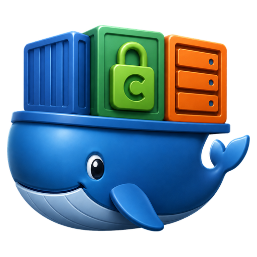

<p align="center">
  
</p>

<h1 align="center">Caddy Custom</h1>

<p align="center">
  HTTPS reverse proxy with Porkbun DNS and Docker label discovery.<br>
  Built once. Ready at every start.
</p>

<p align="center">
  <a href="https://hub.docker.com/r/ctrlcmdshft/caddy-custom/tags">Docker tags</a> ·
  <a href="unraid/caddy-custom.xml">Unraid template</a> ·
  <a href="https://github.com/ctrlcmdshft/caddy-custom/actions">Builds</a> ·
  <a href="https://github.com/ctrlcmdshft/caddy-custom/issues">Issues</a>
</p>

<p align="center">
  <a href="https://github.com/ctrlcmdshft/caddy-custom/actions/workflows/candidate.yml"></a>
  
  
</p>

## What’s included

- **Caddy:** automatic HTTPS and reverse proxying through an existing Caddyfile.
- **Porkbun DNS provider:** DNS challenges for certificate issuance and renewal, including wildcard certificates.
- **Docker discovery:** routes generated from container labels using caddy-docker-proxy.
- **Precompiled modules:** no Go toolchain or module compilation during container startup.
- **Unraid template:** documented settings, masked credential fields, and a custom icon.

This is an independent custom image built from the official Caddy images. Runtime configuration, domains, credentials, and certificate data are supplied locally.

## Docker image tags

Image repository: **`ctrlcmdshft/caddy-custom`** · Platform: **`linux/amd64`**

| Tag | Purpose | Update behavior |
| --- | --- | --- |
| `stable` | Recommended for normal use | Moves only when a tested build is manually promoted |
| `candidate` | Test new builds before promotion | Moves after each successful candidate workflow |
| `build-<run-id>-<attempt>` | Select a specific build or roll back | Unique tag published by each build run |

```bash
docker pull ctrlcmdshft/caddy-custom:stable
```

There is no `latest` tag in the current workflows. Use `stable` to track approved updates, or retain a build tag for rollback. Tags are registry references; use an image digest when immutable pinning is required.

### Initial stable build

| Component | Version |
| --- | --- |
| Caddy | `2.11.4` |
| caddy-dns/porkbun | `0.3.1` |
| caddy-docker-proxy | `2.13.1` |
| Build tag | `build-34157931523-1` |

These describe the initial release, not a live report of upstream versions. Check the workflow run associated with a newer build for its selected versions.

## Install on Unraid

1. Download the [template XML](https://raw.githubusercontent.com/ctrlcmdshft/caddy-custom/main/unraid/caddy-custom.xml) to `/boot/config/plugins/dockerMan/templates-user/my-Caddy-Custom.xml`. **Do not overwrite an existing populated template**; it may contain your local credentials and settings.
2. In **Docker → Add Container**, select **Caddy-Custom**.
3. Choose an unused fixed IP on `br0`, outside the router’s DHCP pool. Docker’s IP allocation does not check router leases.
4. Select the appdata directory and prepare its `Caddyfile` before starting. Enter both Porkbun credentials locally.
5. Apply, then attach the container to the existing application network:

```bash
docker network connect caddy-proxy Caddy-Custom
```

Application containers referenced by Docker name must also join `caddy-proxy`. A GUI edit or image update may recreate the proxy and remove its secondary network attachment. Use a local network-repair script at array startup and periodically, or reconnect manually after changes. This repository does not install that script.

For an existing installation, keep its actual appdata path. Importing a template does not move files, configure DNS, or migrate an existing container.

## Configuration reference

| Setting | Value or purpose |
| --- | --- |
| Appdata mount | Local appdata directory → `/etc/caddy` |
| Base configuration | `/etc/caddy/Caddyfile` |
| Certificate storage root | `XDG_DATA_HOME=/etc/caddy/data` |
| Configuration storage root | `XDG_CONFIG_HOME=/etc/caddy/config` |
| Docker socket | `/var/run/docker.sock` → `/var/run/docker.sock` |
| Porkbun API key | `PORKBUN_API_KEY` — entered locally |
| Porkbun API secret | `PORKBUN_API_SECRET_KEY` — entered locally |
| HTTP | TCP `80` |
| HTTPS | TCP `443` |
| HTTP/3 | UDP `443` |
| Admin API | Keep bound to `localhost:2019`; no host port mapping is needed |

Caddy stores its certificate files beneath the data root’s `caddy` subdirectory. Preserve the complete data and config directories during migration.

The image starts with:

```text
caddy docker-proxy --caddyfile-path /etc/caddy/Caddyfile --ingress-networks caddy-proxy
```

Leave Unraid **Extra Parameters** and **Post Arguments** blank for this default setup. Do not retain an old entrypoint that invokes a build script. The image does not need `CADDY_MODULES`, `CADDY_VERSION_OVERRIDE`, `CADDY_KEEP_BUILD_CACHE`, or the generic `DNS_API_TOKEN` field.

Both Porkbun credentials remain necessary for future certificate renewals. In the Caddyfile, reference them as `{env.PORKBUN_API_KEY}` and `{env.PORKBUN_API_SECRET_KEY}`. Caddy does not provide a built-in dashboard.

## Build and release workflow

### 1. Build a candidate

Run [Build candidate](https://github.com/ctrlcmdshft/caddy-custom/actions/workflows/candidate.yml) with the desired Caddy version and exact plugin versions. The workflow:

1. Compiles the selected versions into an image.
2. Checks the Caddy version, required modules, and docker-proxy command.
3. Publishes a unique build tag and updates `candidate`.

These checks do not verify your DNS credentials, certificate renewal, or application behavior. Test the candidate on a separate IP with a separate appdata copy before promotion.

### 2. Promote a tested image

Run [Promote tested image to stable](https://github.com/ctrlcmdshft/caddy-custom/actions/workflows/promote.yml) with the exact tested build tag. It retags the existing image without rebuilding, publishes `stable`, and verifies that the pulled stable image has the same image ID.

### 3. Update Unraid

Check for updates on the container tracking `stable`, install when ready, and restore its `caddy-proxy` attachment. Keep a known-good build tag and appdata backup for rollback.

**Upstream version checks are not automated yet.** Both workflows are currently started manually, and neither directly updates a running server.

### Repository settings for maintainers

| GitHub setting | Type | Purpose |
| --- | --- | --- |
| `DOCKERHUB_USERNAME` | Actions variable | Docker Hub publishing account |
| `DOCKERHUB_IMAGE` | Actions variable | Image repository in `account/image` format |
| `DOCKERHUB_TOKEN` | Actions secret | Docker Hub token with publishing access |

Porkbun credentials are never needed by these build workflows.

## Unraid icon

The template includes the public [icon URL](https://raw.githubusercontent.com/ctrlcmdshft/caddy-custom/main/assets/caddy-custom-mixed-icon.png). To refresh the icon on an existing **Caddy-Custom** installation:

```bash
curl -fL \
  https://raw.githubusercontent.com/ctrlcmdshft/caddy-custom/main/unraid/install-icon.sh \
  -o /tmp/caddy-install-icon.sh

bash /tmp/caddy-install-icon.sh
```

The installer backs up the local template, changes only its icon field, and refreshes Unraid’s icon caches. It does not restart Caddy. Refresh the Docker page afterward.

## Credentials and backups

- The published template contains empty credential fields. Masking hides their display; it does not encrypt Unraid’s local XML.
- Keep populated templates, appdata, certificates, and backups on your server. Do not commit them to this repository.
- The Docker build context includes only the Dockerfile. The Git allowlist helps prevent accidental additions, but changes still need review.
- Access to the Docker socket is privileged access to Docker; mounting it read-only does not restrict API operations.
- During migration, use separate writable appdata directories. Stop both proxies before making the final certificate/configuration copy.

## Upstream projects

[Caddy](https://github.com/caddyserver/caddy) · [Porkbun DNS provider](https://github.com/caddy-dns/porkbun) · [caddy-docker-proxy](https://github.com/lucaslorentz/caddy-docker-proxy)

The custom artwork is an unofficial illustration inspired by container hosting, HTTPS, and server storage. This project is not an official Docker, Caddy, or Unraid product.
