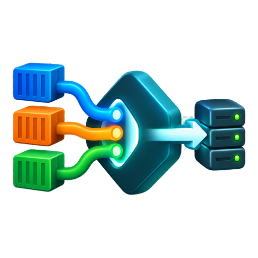

<p align="center">
  
</p>

<h1 align="center">Caddy Custom</h1>

<p align="center">
  Prebuilt Caddy image for Unraid with Porkbun DNS and Docker label discovery.
</p>

<p align="center">
  <a href="https://github.com/ctrlcmdshft/caddy-custom/actions/workflows/candidate.yml"></a>
  <a href="https://hub.docker.com/r/ctrlcmdshft/caddy-custom/tags"></a>
  
</p>

## What It Is

This image builds Caddy once in GitHub Actions instead of compiling modules every
time the Unraid container starts. It includes:

- Caddy `2.11.4`
- `github.com/caddy-dns/porkbun` for Porkbun DNS challenges
- `github.com/lucaslorentz/caddy-docker-proxy/v2` for Docker label discovery
- A public Unraid template with empty, masked Porkbun credential fields

Runtime configuration, domains, API keys, certificates and appdata stay on your
Unraid server. They are not stored in this repository.

## Docker Tags

Image: `ctrlcmdshft/caddy-custom`

| Tag | Use |
| --- | --- |
| `stable` | Normal Unraid use. Updated only after a tested build is promoted. |
| `candidate` | Trial builds before promotion. |
| `build-<run-id>-<attempt>` | Fixed build tag for testing or rollback. |

There is no `latest` tag. Use `stable` in the Unraid template unless you are
testing a specific candidate.

## Unraid Template

Template URL:

```text
https://raw.githubusercontent.com/ctrlcmdshft/caddy-custom/main/unraid/caddy-custom.xml
```

The template sets:

- Repository: `ctrlcmdshft/caddy-custom:stable`
- Appdata: `/mnt/user/appdata/caddy-custom` mounted at `/etc/caddy`
- Docker socket: `/var/run/docker.sock`
- Ports: TCP `80`, TCP `443`, UDP `443`
- Porkbun variables: `PORKBUN_API_KEY` and `PORKBUN_API_SECRET_KEY`
- Storage paths: `XDG_DATA_HOME=/etc/caddy/data` and `XDG_CONFIG_HOME=/etc/caddy/config`

Choose an unused fixed `br0` IP in Unraid. After creating or recreating the
container, attach it to your shared proxy network:

```bash
docker network connect caddy-proxy Caddy-Custom
```

Containers referenced by Docker name in the Caddyfile also need to be attached
to `caddy-proxy`.

## Startup Command

The image starts Caddy with:

```text
caddy docker-proxy --caddyfile-path /etc/caddy/Caddyfile --ingress-networks caddy-proxy
```

Leave Unraid Extra Parameters and Post Arguments blank for the normal setup.
Do not keep old Caddy-Modular build fields such as `CADDY_MODULES`,
`CADDY_VERSION_OVERRIDE`, `CADDY_KEEP_BUILD_CACHE` or `DNS_API_TOKEN`.

Both Porkbun values are required for new certificates and future renewals.

## Releases

The candidate workflow builds and tests the selected Caddy/plugin versions, then
pushes a unique build tag and updates `candidate`. The promote workflow retags a
tested build as `stable` without rebuilding it.

A weekly upstream check opens or updates a GitHub issue when newer Caddy or
plugin releases are available. It does not build images or update `stable`.

Required repository settings:

| Name | Type | Purpose |
| --- | --- | --- |
| `DOCKERHUB_USERNAME` | Actions variable | Docker Hub account |
| `DOCKERHUB_IMAGE` | Actions variable | Docker Hub image, such as `ctrlcmdshft/caddy-custom` |
| `DOCKERHUB_TOKEN` | Actions secret | Docker Hub publish token |

Porkbun credentials are never needed by GitHub Actions.

## License And Attribution

Original files in this repository are MIT licensed. The image includes upstream
software under its own licenses; see [THIRD_PARTY_NOTICES.md](THIRD_PARTY_NOTICES.md)
and the `licenses/` directory.

This is an independent project. Docker, Caddy, Porkbun and Unraid names are used
only to identify compatibility and dependencies.
